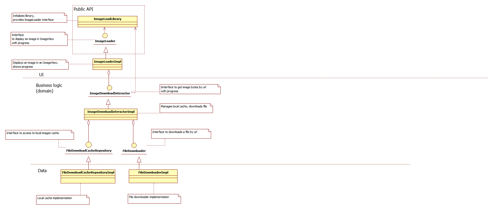

# Image Loading Library

The library downloads an image from the Internet and shows it in ImageView.

## How to use

Create ImageLoadLibrary in you application:

    val imageLoadLibrary: ImageLoadLibrary = ImageLoadLibrary()
 
You can optionally set initialize cache:

    imageLoadLibrary.initCache(path)
If cache is not initialized, all images are downloaded always.   
 
 
Create ImageLoader:
 
    val imageLoader: ImageLoader = imageLoadLibrary.createImageLoader()
 
 Use the ImageLoader to bind view to image:
 
     imageLoader.into(yourImageView) 
     imageLoader.load("https://your_image_url")

You can optionally set placeholders for image, progress color and success/fail handlers:

     /* Should be set before load() */
     imageLoader.progressPlaceHolder = yourBitmapPlaceHolderForProgress
     imageLoader.errorPlaceHolder = yourBitmapPlaceHolderForError
     imageLoader.progressColor = yourProgressColor
     imageLoader.doOnFail = { /* Do on fail */ }
     imageLoader.doOnSuccess = { /* Do on success */}
  

## Implementation details

Used technologies/libraries: Kotlin, Coroutines, Dagger 2.

Class diagram with class description:

 
  
  